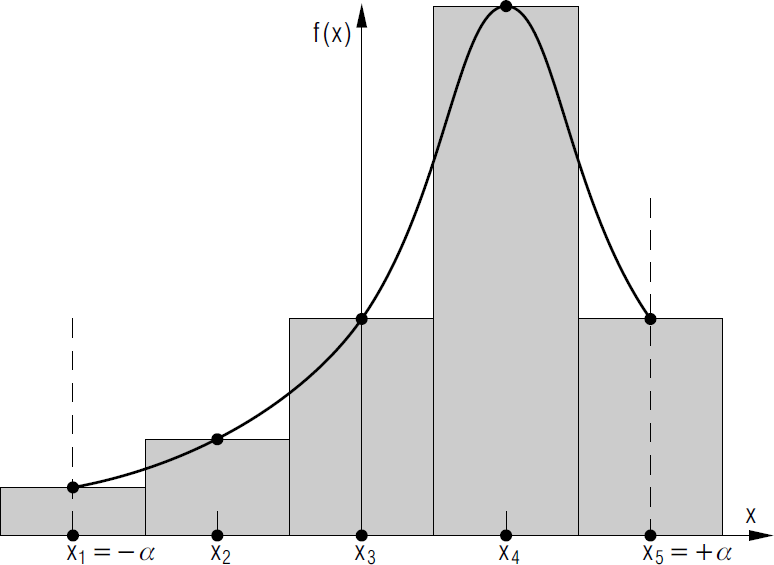
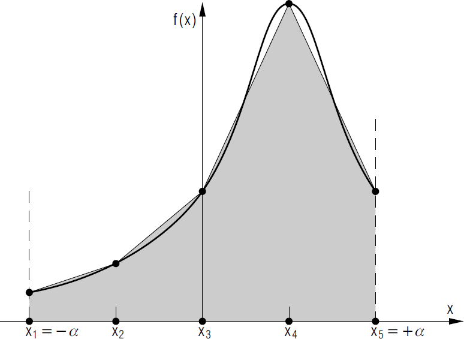
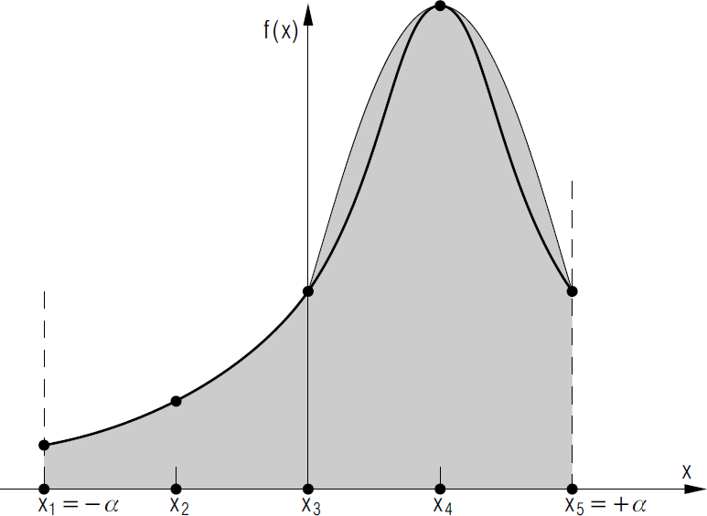
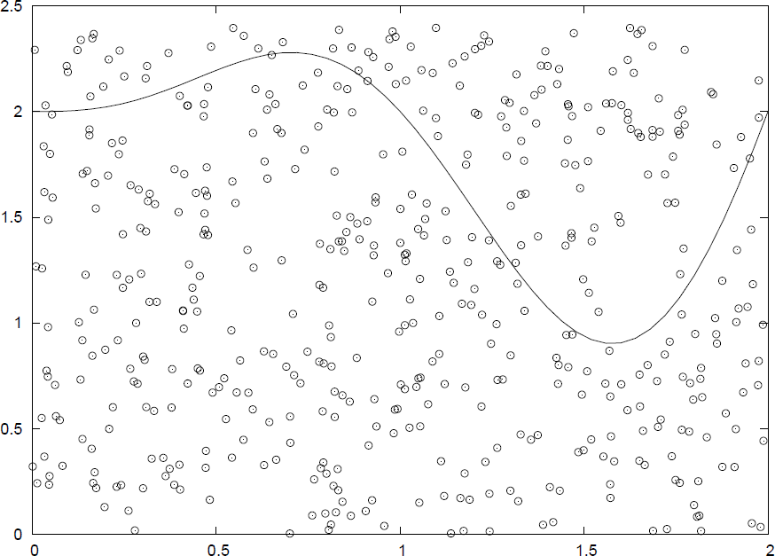

# Computational methods in Physics
## Week 4
#### Prof. Michael Wood-Vasey
##### [based on materials from Prof. Brian D'Urso]
##### University of Pittsburgh, Department of Physics and Astronomy

## Numerical Integration

### Numerical Integration
How do we calculate a definite integral numerically?
* Go back to the Riemann definition of the integral:
$$
\int_a^b f(x) \, \mathrm{d}x = \lim_{n\rightarrow\infty} \left[ \sum_{i=1}^{n} \frac{b-a}{n} f(x_i) \right]
$$
with $x_i = a + i\frac{b-a}{n}$.
* To evaluate numerically, let $n = N \neq \infty$, rewrite as:
$$
\int_a^b f(x) \, \mathrm{d}x \simeq \sum_{i=1}^{N} w_i \, f(x_i) 
$$
* For the simplest approach, ``box counting'':
  - $x_i = a + i\frac{b-a}{N}$ are equally spaced\\
  - and $w_i=\frac{b-a}{N}=h$ is just the width of each box.

### Simple Numerical Integration

### Numerical Integration
* Consider the function $f(x)$ to be interpolated as an $n^{th}$ order polynomial between the points $x_i$. Then:
* $n=0$: a constant $\Rightarrow$ ``box counting''
* $n=1$: a line $\Rightarrow$ trapezoidal rule
* $n=2$: a parabola $\Rightarrow$ Simpson's rule
* $n=3$: cubic $\Rightarrow$ Simpson's $\frac{3}{8}$ rule
* All ``quadrature rules'' take the form:
$$
\int_a^b f(x) \, \mathrm{d}x \simeq \sum_{i=1}^{N} w_i \, f(x_i) 
$$
* The approaches above only vary in their choice of $w_i$.
* More advanced approaches also move around the $x_i$.

### Trapezoidal Rule
* If $f(x)$ is taken to be a straight line between\\
 $x_i$ and $x_{i+1}$, then:
$$
\int_{x_i}^{x_{i+1}} f(x) \, \mathrm{d}x \simeq h \left[\tfrac{1}{2} \, f(x_i) + \tfrac{1}{2} \, f(x_{i+1})\right] 
$$
is the area of a single trapezoid.
* Add up the area of all the trapezoids: 
$$
\int_a^b f(x) \, \mathrm{d}x & \simeq \sum_{i=1}^{N} w_i \, f(x_i) \\
& \simeq \tfrac{h}{2} f(x_1) + h f(x_2) + \cdots + h f(x_{N-1}) + \tfrac{h}{2} f(x_N)
$$
* So, the weights are:
$$
w_i = \left\{ \tfrac{h}{2}, h, h, \ldots h, \tfrac{h}{2} \right\}
$$

### Trapezoidal Rule

### Simpson's Rule
* If $f(x)$ is taken to be a parabola between\\
 $x_i$ and $x_{i+2}$ (2 intervals!), then:
$$
\int_{x_i}^{x_{i+2}} f(x) \, \mathrm{d}x 
\simeq h \left[\tfrac{1}{3} \, f(x_i) + \tfrac{4}{3} \, f(x_{i+1}) + \tfrac{1}{3} \, f(x_{i+2})\right] 
$$
is the area of a single parabola (spanning $2h$).
* Add up the area of all the parabolas: 
$$
\int_a^b f(x) \, \mathrm{d}x \simeq \sum_{i=1}^{N} w_i \, f(x_i)
$$
the weights are:
$$
w_i = \left\{ \tfrac{h}{3}, 4\tfrac{h}{3}, 2\tfrac{h}{3}, 4\tfrac{h}{3}, 2\tfrac{h}{3}, \ldots 4\tfrac{h}{3}, \tfrac{h}{3} \right\}
$$
* Since each parabola takes up two intervals, we must have an odd number of points (i.e. $N$ is odd)!

### Simpson's Rule

### Gaussian Quadrature

* Begin with the same form:
$$
\int_a^b f(x) \, \mathrm{d}x \simeq \sum_{i=1}^{N} w_i \, f(x_i)
$$
* But, now choose $w_i$ and $x_i$ (not equally spaced).

* Exact if $f(x)$ is a $2N-1$ degree polynomial.

* One approach (Gauss-Legendre):

* $x_i$ is the $i^{th}$ root of $P_N(x)$, $P_N(x)$ is a Legendre polynomial scaled to the appropriate range.

* $w_i$ given by:
$$
w_i = \frac{2}{(1-x_i^2)[P^\prime_N(x_i)]^2}
$$

* We will not write this kind of routine ourselves.

### Monte Carlo Integration

* Try a different approach:\\
The first mean value theorem for integration says:
$$
\int_a^b f(x) \, \mathrm{d}x = (b-a) \, \langle f \rangle
$$
where $\langle f \rangle$ is the mean value of $f(x)$ on $[a, b]$.
* Then, all we have to do is evaluate $\langle f \rangle$.

* How? Pick $N$ random values, $x_i$ in $[a, b]$. Then:
$$
\langle f \rangle \simeq \frac{1}{N} \sum_{i=1}^{N} f(x_i)
$$
so
$$
\int_a^b f(x) \, \mathrm{d}x \simeq  \frac{b-a}{N} \sum_{i=1}^{N} f(x_i)
$$

### Monte Carlo Integration (continued)

* Monte Carlo integration converges slowly.

* But, it has some advantages:

* In some cases it is much easier than other methods to implement.

* In some cases, it is the only reasonable choice.

* In 2-D problems, can use it to calculate areas:

* In $N$-D problems (with $N \gg 1$), it can give a quick estimate of the result.

### SciPy Integration Routines
The SciPy integration sub-package `scipy.integrate` provides several integration routines. An overview of the module is provided by the help command:\\
`help(scipy.integrate)`\\

Methods for Integrating Functions given function object:

* `quad`: General purpose integration.

* `dblquad`: General purpose double integration.

* `tplquad`: General purpose triple integration.

* `fixed_quad`: Integrate $f(x)$ using Gaussian quadrature of order $n$.

* `quadrature`: Integrate with given tolerance using Gaussian quadrature.

* `romberg`: Integrate $f$ using Romberg integration.

### SciPy Integration Example
You should write your own integration routines for your assignment, but here is an example with SciPy functions for future reference:

* Setup module and function to be integrated:\\
`import scipy.integrate`
`def f(x): return 2.0*x`

* Integrate:\\
`scipy.integrate.quad(f, 0.0, 3.0)`

``Canned'' library routines are easy to use, but harder to tell what is going on in the calculation.

