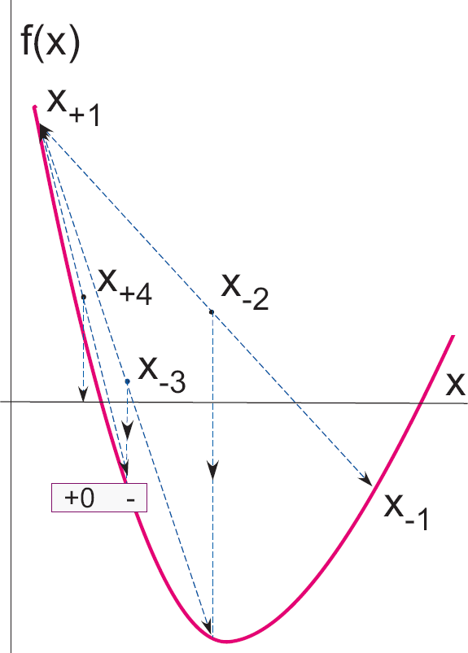
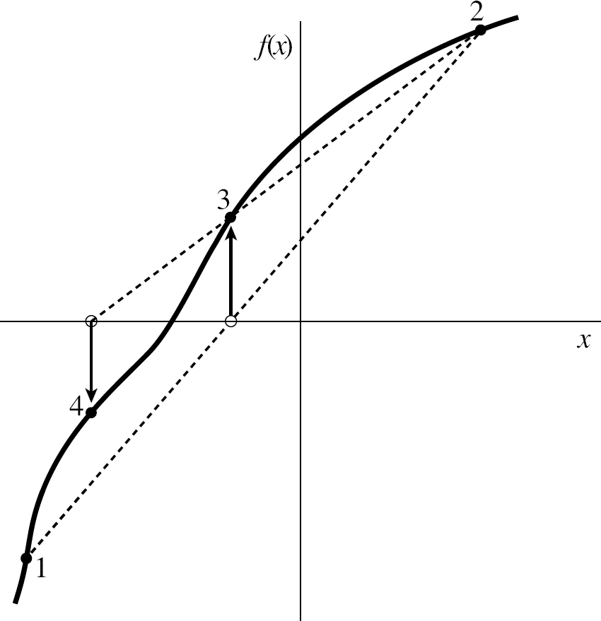

# Computational methods in Physics
## Week 5
#### Prof. Michael Wood-Vasey
##### [based on materials from Prof. Brian D'Urso]
##### University of Pittsburgh, Department of Physics and Astronomy

## Numerical Differentiation

### Numerical Differentiation
We know how to integrate numerically, how about differentiating?

* Numerical derivatives are even easier than integrals!
* Go back to definition of derivative:
$$
f^\prime (x) = \frac{d}{dx}f(x) = \lim_{\epsilon\to 0} \frac{f(x+\epsilon)-f(x)}{\epsilon}
$$
* As with integration, use finite $\epsilon$ instead of $\epsilon\to 0$.
* This will give us another piece of the puzzle for solving differential equations (ODEs and PDEs) numerically.


### Forward Difference Method

* Start with the forward difference operator $D_f\left[f(x), h\right]$:
$$
f^\prime(x) \simeq D_f\left[f(x), h\right] = \frac{f(x+h)-f(x)}{h}
$$
* Compare to the Taylor expansion of $f(x+h)$:
$$
f(x+h) = f(x) + h f^\prime(x) + \frac{h^2}{2} f^{\prime\prime}(x) + \cdots
$$
* By comparison, we see:
$$
D_f\left[f(x), h\right] &= f^\prime(x) + \frac{h}{2} f^{\prime\prime}(x) + \cdots   
&\simeq f^\prime(x) + \mathcal{O}(h)
$$
* So, the error scales as $h$.


### Forward Difference Example

* Consider the function: $f(x) = a + b x^2$
* The exact derivative is $f^\prime(x) = 2 b x$
* Applying the Forward Difference Approximation gives:
$$
f^\prime(x) \simeq \frac{f(x+h)-f(x)}{h} = 2 b x + b h
$$
* As expected, error $\propto h \Rightarrow$ need very small $h$.


### Improvement: Central Difference Method

* Start with the same $h$, but make the difference symmetrical:
$$
f^\prime(x) \simeq D_{cd}\left[f(x), h\right] = \frac{f(x+h/2)-f(x-h/2)}{h}
$$
* Again, by comparison with the Taylor series at $f(x \pm h/2)$:
$$
D_{cd}\left[f(x), h\right] &= f^\prime(x) + \frac{1}{24} h^2 f^{(3)}(x) + \cdots   
&\simeq f^\prime(x) + \mathcal{O}(h^2)
$$
* All even derivatives cancel.
* Now the error $\propto h^2$\\ (one order better than forward difference).
* Exact for $f(x) = a + b x^2$.
* Better rule $\Rightarrow$ can use larger $h$.


### Extrapolated Difference Method

* Consider the error in the central difference method:
$$
D_{cd}[f(x), h] \simeq f^\prime (x) + \frac{1}{24}h^2 f^{\prime\prime\prime}(x) + \mathcal{O}(h^4)
$$
* Compare to:
$$
D_{cd}[f(x), h/2] \simeq f^\prime (x) + \frac{1}{96}h^2 f^{\prime\prime\prime}(x) + \mathcal{O}(h^4)
$$
* Cancel the quadratic term using the difference between the two $\Rightarrow$ \textit{Extrapolated Difference Method}:
$$
D_{ed}[f(x), h] &= \frac{4 D_{cd}[f(x), h/2] - D_{cd}[f(x), h]}{3}  
&\simeq f^\prime (x) + \frac{h^4 f^{(5)}(x)}{4\times 16 \times 120} + \cdots
$$


### Second Derivatives

* Start with the central difference method:
$$
f^\prime(x) \simeq D_{cd}\left[f(x), h\right] = \frac{f(x+h/2)-f(x-h/2)}{h}
$$
* Apply central difference method twice:
$$
f^{\prime\prime}(x) &\simeq D_{cd}[f^\prime (x), h]  
                    &\simeq D_{cd}\left[D_{cd}[f(x), h], h\right]  
                    &\simeq \frac{f^\prime(x+h/2)-f^\prime(x-h/2)}{h}  
                    &\simeq \frac{[f(x+h)-f(x)]-[f(x)-f(x-h)]}{h^2}  
                    &\simeq \frac{f(x+h)-2 f(x)+f(x-h)}{h^2}
$$


## Root Finding

### Root Finding
Can we use numerical techniques to solve $f(x)=0$ for $x$?  
We will use 3 methods:

* Bisection method:  
repeated bracketing.
* Newton-Raphson method:  
linear approximation with analytical derivative.
* Secant method:  
linear approximation with numerical derivative.


### Bisection Method
There is little more than repeated bracketing to our first root-finding method, bisection:
1. Start with the initial bracket $\left[x_1^{(1)}, x_2^{(1)}\right]$ with $f\left(x_1^{(1)}\right)f\left(x_2^{(1)}\right) < 0$.    
Assume $x_1^{(1)} < x_2^{(1)}$ without loss of generality.
2. Guess the location of the root as the midpoint:   
$x_0^{(1)}=\left(x_1^{(1)}+x_2^{(1)}\right)/2$.
3. If $f\left(x_0^{(1)}\right)$ has the same sign as $f\left(x_1^{(1)}\right)$,\\ 
set the new bracket to $\left[x_1^{(2)}, x_2^{(2)}\right]=\left[x_0^{(1)}, x_2^{(1)}\right]$,\\ 
else set it to $\left[x_1^{(2)}, x_2^{(2)}\right]=\left[x_1^{(1)}, x_0^{(1)}\right]$.  
4. The location of the root is now known to precision $\left|x_1^{(2)}-x_2^{(2)}\right|$. If this is not satifactory, go back to step 2 to obtain the next bracket $\left[x_1^{(3)}, x_2^{(3)}\right]$.


### Bisection Method (2)



### Bisection Method (3)

* For continuous functions, this method is guaranteed to converge to the root.
* At each step, the error is halved.
* The method is said to be linearly convergent, because the number of correct digits in the answer (the location of the root) grows linearly with the number of iterations (one decimal digit every $\log_2(10)$ iterations).


### Newton-Raphson Method
The idea of the Newton-Raphson method is to use information about the derivative of the function to guide the choice of a sequence of points converging to the root.
1. Start from the initial guess $x^{(1)}$.
2. Approximate the function around $x^{(1)}$ by the fist two terms of its Taylor expansion   
(i.e., as the straight line through $\left[x^{(1)}, f\left(x^{(1)}\right)\right]$ with the same slope as the curve $f(x)$):   
$f(x)\approx f\left(x^{(1)}\right) + f^\prime \left(x-x^{(1)}\right) + \cdots$.  
An approximate guess ($x^{(2)}$) for the root is obtained by setting $f(x) = 0$, yielding   
$x^{(2)} = x^{(1)} - \frac{f\left(x^{(1)}\right)}{f^\prime\left(x^{(1)}\right)}$.
3. Compare the value of $f\left(x^{(1)}\right)$ with a predetermined tolerance to decide whether to stop or go back to step 2 and obtain $x^{(3)}$.


### Newton-Raphson Method (2)


### Newton-Raphson Method (3)

* If the function is sufficiently linear near the last guess, $x^{(last)}$,
the precision of the location of the root is approximately $\left|f\left(x^{(last)}\right)/f^\prime\left(x^{(last)}\right)\right|$.
* The advantage of this method is that it converges quadratically.  
The number of correct digits in the answer approximately doubles with each iteration.
* This method is not guaranteed to converge.  
A local extremum will send the next guess towards infinity.
* Possible to combine methods by bracketing.  
Use bisection if Newton-Raphson goes outside bracketed range.


### Secant Method

* The secant method is a close relative of the Newton-Raphson method.
* Does not require the explicit knowledge of the derivative $f^\prime(x)$.
* Derivative is approximated by tracing a straight line through the last two points examined.
* Converges more slowly than Newton-Raphson.  
Order of convergence is the golden ratio: $\phi = 1.618\cdots$.  
Number of correct digits is multiplied by $\phi$ at each iteration.
* Similar weaknesses to Newton-Raphson.


### Secant Method (2)



### Secant Method (3)
1. Start from two initial guesses, $x^{(1)}$ and $x^{(2)}$.  
2. Approximate the derivative at $x^{(2)}$ by the slope of the line that joins $\left[x^{(1)}, f\left(x^{(1)}\right)\right]$ to $\left[x^{(2)}, f\left(x^{(2)}\right)\right]$:   
$f^\prime\left(x^{(2)}\right) = \frac{f\left(x^{(2)}\right)-f\left(x^{(1)}\right)}{x^{(2)}-x^{(1)}}$.  
* Take a Newton-Raphson step to find $x^{(3)}$:  
$x^{(3)} = x^{(2)}-f\left(x^{(2)}\right)\frac{x^{(2)}-x^{(1)}}{f\left(x^{(2)}\right)-f\left(x^{(1)}\right)}$.  
3. Compare $f\left(x^{(3)}\right)$ with the tolerance to decide whether to continue the iteration.   
If needed, repeat step 2 to get the next value with:   
$x^{(i)} = x^{(i-1)}-f\left(x^{(i-1)}\right)\frac{x^{(i-1)}-x^{(i-2)}}{f\left(x^{(i-1)}\right)-f\left(x^{(i-2)}\right)}$.   
Estimate precision as in the Newton-Raphson method.


### Newton-Raphson Method Implementation
```
def Newton(f, dfdx, x, eps=1.0E-7, N=100):
  for n in range(N):
    y = f(x)
    print x, y, n
    if abs(y) < eps: break
    x -= y/dfdx(x)
  return x, y, n
```
Note: `f` and `dfdx` are functions which return the value and derivative of the function of which you want to find a root.


### Newton-Raphson Method Example
Solve $\sin(x)-0.75=0$  
```
import math
 
def g(x):
  return math.sin(x) - 0.75
 
def dgdx(x):
  return math.cos(x)

Newton(g, dgdx, 0.0)
``` 

### SciPy Root Finding Routines
The SciPy optimize sub-package `scipy.optimize` provides several root-finding routines. An overview of the module is provided by the help command:   
```
help(scipy.optimize)
```
Methods for finding roots of a given function object:

* `brentq`: quadratic interpolation Brent method.
* `brenth`: Brent method, modified by Harris with hyperbolic extrapolation.
* `ridder`: Ridder's method.
* `bisect`: Bisection method.
* `newton`: Secant method or Newton's method.

### SciPy Root Finding Example
You should write your own root finding routines for your assignment, but here is an example with SciPy functions for future reference:

* Setup module and function to be integrated:  
```
import scipy.optimize
def f(x): return x**2 - 4.0
```
* Find a root:  
```
scipy.optimize.newton(f, 0.5)
```
* Or:  
```
scipy.optimize.bisect(f, 0.5, 3.0)
```

"Canned" library routines are easy to use, but it's harder to tell what is going on in the calculation.  It's helpful to know the basics of how the algorithm might work to know what questions and what **tests** to write.


