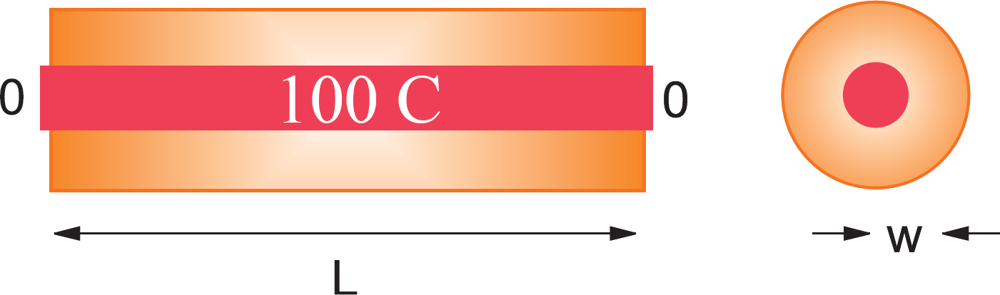
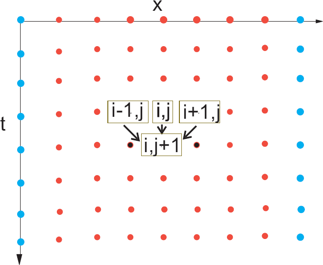
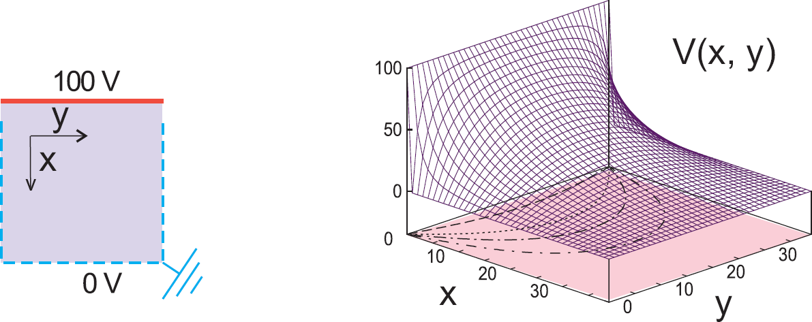
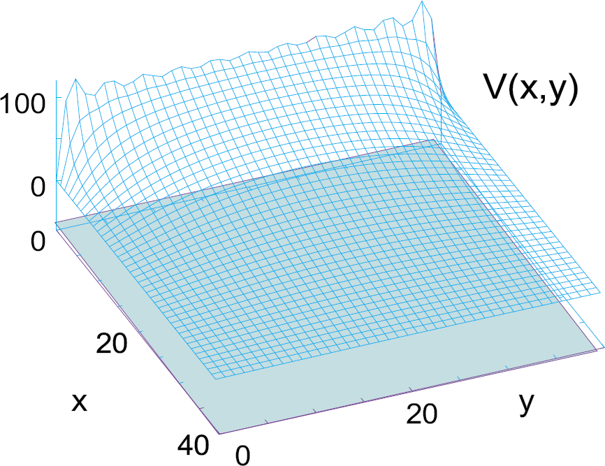
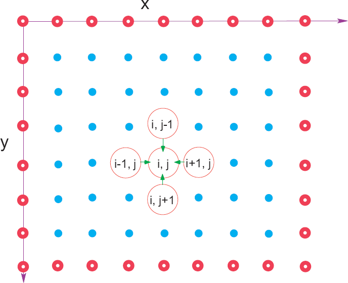
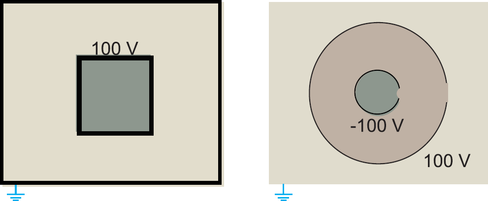

# Computational methods in Physics
## Week 09
#### Prof. Michael Wood-Vasey
##### [based on materials from Prof. Brian D'Urso]
##### University of Pittsburgh, Department of Physics and Astronomy

#### ODE Initial Value Problems
We have been solving equations like:
\begin{equation*}
\frac{d\mathbf{y}(t)} {dt} =  \mathbf{f}(\mathbf{y}, t)
\end{equation*}
where:

* The function $\mathbf{f}(\mathbf{y}, t)$ is given.
* An initial condition is given, e.g. $y(0) = 1.0$.
* The problem is to find $\mathbf{y}(t)$ for a requested range of $t$.
* We refer to finding the solution $\mathbf{y}(t)$ as
solving or integrating a
first order
ordinary differential equation (ODE)
initial value problem.

#### Partial Differential Equations (PDEs)

* PDEs contain derivatives with respect to multiple variables, e.g.: $\frac{\partial U}{\partial t}$, $\frac{\partial U}{\partial x}$, etc.
* The solution to our PDE is a field, e.g. $U(x, y, z, t)$.
* $U$ might be a physical quantity e.g. ($T$, $P$) which varies continuously in $x$ and $t$.
* Changes in $U(x,y,z,t)$ affect $U$ nearby.
*  What about boundary conditions or initial conditions?
*  How do we solve PDEs numerically?

* Need to discretize multiple independent variables.

#### General Forms of 2-D PDEs
$$
A\,  \frac{\partial^2 U}{\partial x^2}+ 2B \, \frac{\partial^2
U}{\partial x \partial y}+C  \,\frac{\partial^2 U}{\partial y^2} +
D\, \frac{\partial U}{\partial x}+E \,\frac{\partial U}{\partial
y} =F
$$

| **Elliptic** | **Parabolic** | **Hyperbolic**  |
|--------------|---------------|-----------------|
| $d=B^2-AC<0$ | $d=B^2-AC=0$  | $d=B^2-AC>0$    |
| $\nabla^2 U(x,y) = -4\pi\rho(x,y)$ | $\frac{\partial^2 U(x,t)}{\partial x^2}= a\,\frac{\partial U(x,t)}{\partial t}$  | $\frac{\partial^2 U(x,t)}{\partial x^2}=c^{-2}\frac{\partial^2 U}{\partial t^2}$ |
| Poisson | Heat | Wave |

* Elliptic PDE:  All 2nd order, same signs.
* Parabolic PDE:  1st order and 2nd order derivatives.
* Hyperbolic PDE:  All 2nd order, opposite signs.

#### Relation to Boundary Conditions & Uniqueness
| **Boundary Condition**  | **Elliptic** (Poisson) |  **Hyperbolic** (Wave)| **Parabolic** (Heat) |
|---------------|--------------|-----------------|----------------|
| Dirichlet open $S$   | Under | Under | *Unique & stable (1-D)* |
| Dirichlet closed $S$ | *Unique & stable* | Over | Over |
| Neumann open $S$     | Under | Under | *Unique & Stable (1-D)* |
| Neumann closed $S$   | *Unique & stable* | Over |Over |
| Cauchy open $S$ | Nonphysical | *Unique & stable* | Over |
| Cauchy closed $S$|Over | Over| Over |

* Boundary conditions: must be sufficient for unique solution.
* Dirichlet: value on surrounding closed $S$.
* Neumann: value normal derivative on surrounding $S$.
* Cauchy: both solution & derivative on closed boundary.

#### Solving PDEs & ODEs Is Different
No Standard PDE Solver

* Standard form for ODE:
$$
\frac{d\mathbf{y}(t)} {dt} =  \mathbf{f}(\mathbf{y}, t)
$$
* Single independent variable $\implies$ standard algorithm
(e.g. `rk4`).
* PDEs: several independent variables: $U(x,y,z,t)$.
* $\implies$  PDE solving is complicated:

*  More variables, more equations, more  ICs, BCs.
* Each PDE and particular BCs $\implies$ particular algorithm.

### Heat Equation

#### Problem: How Does a Bar Cool?

Insulated Metallic Bar Touching Ice

* Aluminum bar, $L=1$~m, $w$ along $x$.
* Insulated along length, ends in ice ($T=0^\circ$C).
* Initially $T=100^\circ$C.
* How does temperature vary in space and time?

#### The Parabolic Heat Equation (Theory)
1. Nature: heat flow  hot $\rightarrow$ cold  
  $T$ = temperature
  $K$ = conductivity  
  $C$ = specific heat  
  $\rho$ = density  
$$H = - K \,\mathbf{\nabla} T(\mathbf{x}, t)$$
2. $Q(t)$ = contained heat
$$Q(t) = \int dx\, C \rho(x) \, T(x, t)$$
3. Heat Eqn: $\Delta T$ from flow
$$\frac{\partial T(x, t)}{\partial t} = \frac{K}{C \rho} \nabla^2 T(x, t)$$
4. Parabolic PDE in  $x$ & $t$
$$\frac{\partial T(x,t)}{\partial t} = \frac{K}{C\rho}\frac{\partial ^2 T(x,t)}{\partial x^2}$$
5. "Analytic" Solution  
   Initial condition:  
   $T(x,t=0) = 100^\circ$C  
   Boundary conditions:  
   $T(x=0) = T(x=L) = 0^\circ$C  
$$T(x,t) = \sum_{n=1,3,\ldots}^\infty  \frac{400\sin\,k_n x\,e^{-\alpha k_n^2 t}}{n\pi} $$
$$(k_n = \frac{n\pi}{L}, \alpha = \frac{K}{C\rho})$$

#### Solution Via Time Stepping

\begin{align*}
\frac{\partial T}{\partial t} \simeq & \frac{T(x,t+\Delta t)-T(x,t)}{\Delta t}\\
\frac{\partial^2 T}{\partial x^2} \simeq & \frac{T(x +\Delta x)+T(x-\Delta x)-2 T(x)}{(\Delta x)^2}
\end{align*}

* Differential $\rightarrow$ difference equation.
* Solve at $x,t$ lattice sites.
* blue = BC
  row 0 = IC
* $\partial t$: forward difference  
  $\partial^2 x$: central difference  
  $\implies$  difference  heat equation  
* Step $\downarrow$ one $t$ to next.

\begin{align}
\frac{T(x,t+ \Delta t)-T(x,t)}{\Delta t} =& \frac{K}{C\rho}\frac{T(x+\Delta x,t) +T(x-\Delta x,t) -2 T(x,t)}{\Delta x^2} \\
T_{i,j+1} =& T_{i,j}+ \eta \left[T_{i+1,j}+T_{i-1,j}-2T_{i,j}\right]
\end{align}

#### Von Neumann Stability Analysis
$$
T_{m,j+1} \ = \  T_{m,j}+ \eta
\left[T_{m+1,j}+T_{m-1,j}-2T_{m,j}\right], \\\  x = m \Delta x,  t=j \Delta t
$$

* How do we tell if difference solution is approximately a solution of the PDE?
  - It's certainly bad if difference diverges.
* Analysis of error behavior possible:
  - Expand spatial variation of error in Fourier series.
  - Examine time dependence of each term in series.
  - For stability, all terms must decay exponentially with time $t$.

* Requirement for stability:
\begin{equation}
\eta = \frac{K\,\Delta t}{C\rho\,\Delta x^2}<\frac{1}{2} 
\end{equation}
* $\implies$ Smaller $\Delta t$ more stable
* To use $\downarrow$ $\Delta x$ must use $\downarrow$ $\Delta t$

### Classic Problem $V$ for Arbitrary Geometry & Boundary Conditionss

#### Solve *Inside* Charge-Free Square
* Boundaries are conductors at fixed voltage.
* Closed boundary (insulate openings).
* $\implies$ Neumann conditions on the boundary.
* $\implies$ Unique & stable solution.

### Laplace Equation

#### Classic Problem: $V$ for Arbitrary Geometry & Boundary Conditions 

#### Solve **Inside Charge-Free Square**

* Boundaries are conductors at fixed voltage.
* Closed boundary (insulate openings).
* $\implies$ Neumann conditions on the boundary.
* $\implies$ Unique & stable solution.

#### Laplace & Poisson Elliptic PDEs (Theory)

* Classical EM,  static charges, **Poisson Equation**:
$$
\nabla^2 U(x) = - 4 \pi \rho(x)
$$
* **Laplace equation** if $\rho(x)=0$:
$$
\nabla^2 U(x) = 0
$$
* Solve in 2-D rectangular coordinates:
 $$
\frac{\partial^2 U(x,y)}{\partial x^2}+ \frac{\partial^2
U(x,y)}{\partial y^2 } =
\begin{cases}
0, & \mbox{Laplace equation,} \\
- 4 \pi \rho(x), & \mbox{Poisson equation}
\end{cases}
 $$
* $U(x,y)$: two independent variables $\implies$ PDE.

#### Fourier Series Solution As Algorithm
#### Standard Textbook Solution Not Always Good
$$
U(x,y)=\sum_{n=1,3,5,\ldots}^\infty \frac{400}{n\pi} \sin
\left(\frac{n\pi x}{L}\right)\, \frac{\sinh (n\pi y/L)}{\sinh
(n\pi)}
$$

* Sum not separable: $\neq \ X(x)\ Y(y)$. 
* Sum = infinite; not true analytic solution.
* **Algorithm: $\sum^{\infty} \simeq \sum^{N}$**
* Painfully slow convergence $\implies$ round-off error.
* $\sinh(n)$ means overflow for large $n$.

* Converges in *mean square*, Gibbs overshoot. $N\neq\infty$

#### Fourier-Gibb's Overshoot at Discontinuities

#### Finite-Difference Form of Poisson Equation
$$
\frac{\partial^2 U(x,y)}{\partial x^2}+ \frac{\partial^2
U(x,y)}{\partial y^2 } =
\begin{cases}
0, & \mbox{Laplace equation,} \\
- 4 \pi \rho(x), & \mbox{Poisson equation}
\end{cases}
$$

* Form 2-D $x-y$ lattice.
* Solve for $U$ at each lattice site.
* Derivatives $\rightarrow$ **finite-differences**.
* Or use finite-elements (non-square grid)
  $\implies$ more efficient, harder setup

#### Finite-Difference Form of Poisson Equation

1. Forward difference $\partial/\partial x$:
\begin{align*}
U(x +\Delta x, y) = &  U(x,y) + \frac{\partial U} {\partial x} \Delta x
+ \frac{1}{2} \frac{\partial^2 U} {\partial x^2}(\Delta x)^2 + \cdots \\
U(x -\Delta x, y) = &  U(x,y) - \frac{\partial U}{\partial x}
\Delta x + \frac{1} {2} \frac{\partial^2 U}{\partial x^2} (\Delta
x)^2 - \cdots
\end{align*}
2. Add series, odd terms cancel:
$$
\frac{\partial^2 U(x,y)}{\partial x^2} \simeq 
\frac{U(x+\Delta x, y) + U(x-\Delta x, y) -2U(x,y)} {(\Delta x)^2}
$$
  $\implies$ Finite-difference Poisson PDE:
\begin{align*}
& \frac{U(x+\Delta x,y) + U(x-\Delta x,y)-2 U(x,y)}{(\Delta x)^2} + \\
& \frac{U(x,y+\Delta y) + U(x,y-\Delta y)-2
U(x,y)}{(\Delta y)^2} = -4\pi\rho
\end{align*}

#### Solve Discrete Poisson Equation on Lattice

\begin{align}
- 4 \pi \rho(x) =& \frac{\partial^2 U(x,y)}{\partial x^2}+\frac{\partial^2 U(x,y)}{\partial y^2 }\\
-4\pi\rho_{i,j}\Delta^2 =& U_{i+1, j}  + U_{i-1, j}  +  U_{i, j+1} + U_{i, j-1} -4 U_{i,j} \\
\Rightarrow\quad U_{i,j} =& \frac{1}{4}\left[ U_{i+1,j}+U_{i-1,j}+U_{i,j+1}+U_{i,j-1} \right] + \pi\rho_{i,j} \Delta^2
\end{align}

 

* Solve (2): a **big** matrix!
* **Correct solution = average of 4 nearest neighbors.**
* Can we iterate to relax to the solution?
* Need to know if we arrive or fail.

#### Relaxation Method

#### How do we iterate towards a solution?

* Jacobi: update $U$ after full sweep:

* Maintains symmetry of BC.

* Gauss--Seidel: always use latest $U$:
\begin{equation*}
U^{\rm(new)}_{i,j} = \frac{1}{4}\left[U^{\rm (old)}_{i+1,j} + U^{\rm (new)}_{i-1,j} + U^{\rm (old)}_{i,j+1} +  U^{\rm (new)}_{i,j-1} \right]
\end{equation*}

* Faster convergence $\implies$ $\downarrow$ RO error.
* Decreased memory.
* Distorts symmetry of BCs.

#### Successive Over Relaxation (SOR)

#### New = Old + Residual
\begin{align}
U^{\rm (new)_{i,j}}  = & { U^{\rm (old)}_{i,j}  + r_{i,j}}\\
r_{i,j } \equiv & U^{\rm (new)}_{i,j} - U^{\rm (old)}_{i,j} \\
 =& {\frac{1}{4}\left[U^{\rm (old)}_{i+1,j} + U^{\rm (new)}_{i-1,j} + U^{\rm (old)}_{i,j+1} +  U^{\rm (new)}_{i,j-1} \right] 
-U^{\rm (old)}_{i,j}} \\
\end{align}

**Successive Over Relaxation**
$$
 U^{\rm (new)_{i,j} = U^{\rm (old)}_{i,j} + \omega \ r_{i,j}}
$$

|       Method     |    $\omega$     |
| ---------------- | --------------- |
| Gauss-Seidel     | $=1$      |
| Over-relaxation  | $\ge 1$  |
| Under-relaxation | $<1$     |
| Unstable         | $\geq 2$ |
 
* Determine $\omega$ empirically

#### Non Ideal Capacitors
#### Small Plates, Large Gaps $\implies$ Edge & Fringe Effects

* $U=0$ boundary for uniqueness.
* Simple: thin plates $\pm 100$ V.
* Interest: thick plates, $\rho(x) =?$
  Laplace $\implies$ $U(x,y)$
  Poisson $\implies$ $\rho(x,y)$\\*
* Could have arbitrary BCs
  e.g. $U(x) = 100 \sin\left(\frac{2\pi x}{w}\right)$
