# Computational methods in Physics
## Week 11
#### Prof. Michael Wood-Vasey
##### [based on materials from Prof. Brian D'Urso]
##### University of Pittsburgh, Department of Physics and Astronomy

### Problem
#### Problem: Why Is Nature So Complicated?

* Insect populations, weather patterns
* Complex behavior
* Stable,  periodic,   chaotic, stable, \ldots
*  **Problem:** can a simple, discrete law  produce such complicated
behavior?

### Logistic Map
#### Model Realistic Problem: Bug Cycles

##### Bugs Reproduce Generation after Generation = $i$

*   $N_0\ \rightarrow \  N_1, N_2, \ldots  N_\infty$
*  $N_i = f(i)?$
* Seen discrete law,
\begin{eqnarray}
\frac{\Delta N}{\Delta t} =\ & -\lambda N 
\Rightarrow\   \simeq\ & e^{-\lambda t}
\end{eqnarray}
*   $-\lambda \rightarrow +\lambda$ $\implies$  growth

$$
\frac{\Delta N_i}{\Delta t} = \lambda \; N_i
$$

#### Refine Model: Maximum Population $N_*$

##### Incorporate Carrying Capacity into Rate

* Assume  breeding rate proportional to   number of bugs:
$$
\frac{\Delta N_i}{\Delta t} = \lambda \; N_i
$$
 * Want growth rate   $\downarrow$  as  $N_i \rightarrow N_{*}$
 * Assume $\lambda=\lambda' (N_*-N_i)$
$$
  \Rightarrow\ \ {\frac{\Delta
N_i}{\Delta t} =
\lambda'(N_{*}-N_i)N_i} \quad \quad \mbox{(Logistic Map)}
$$
* Small $N_i/N_*$ $\implies$ exponential growth
*  $N_i \rightarrow N_*$  $\implies$ slow growth, stable, decay

#### Logistic as Map in Dimensionless Variables

As Population, Change Variables
$$
\begin{align}
N_{i+1}  = & N_i + \lambda' \, \Delta t (N_{*}-N_i)N_i 
 {x_{i+1}} \ =\ & {\mu x_{i}(1- x_{i}) \quad\quad\mbox{(Logistic Map)}}
\mu \deq\ & 1 + \lambda' \,\Delta  t N_{*}, \quad \quad x_{i} \deq
\frac{\lambda' \,  \Delta  t}{\mu} N_i\simeq
\frac{N_i}{N_{*}}
x_{i} \simeq \frac{N_i}{N_{*}} \  =& \  \mbox{fraction of max}
\end{align}
$$

*   $0 \leq x_{i} \leq 1$
*  Map: $x_{i+1} = f(x_i)$

*  Quadratic,  1-D map
* $f(x) = \mu x(1-x)$

### Properties
#### Properties of Nonlinear Maps (Theory)

Empirical Study: Plot  $x_i$ \emph{vs}  $i$

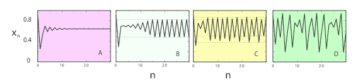

* A: $\mu = \textrm{2.8}$, equilibration into single population
* B:  $\mu = \textrm{3.3}$, oscillation between 2 population levels
* C:  $\mu = \textrm{3.5}$ oscillation among 4 levels
* D:    chaos

### Attractors
#### Fixed Points
$x_{i}$ Stays at $x_{*}$ or Returns

$$
x_{i+1} = \mu x_i (1-x_i)
$$

*  One-cycle: $x_{i+1} = x_{i} = x_{*}$
\begin{align}
\mu x_{*} (1-x_{*}) \ = &\  x_{*}
\Rightarrow\  x_{*}  \ =&\  0, \quad   x_{*} = \frac{\mu -
1}{\mu}
\end{align}
  
  
 #### Period Doubling, Attractors
Unstable via  Bifurcation into 2-Cycle

* Attractors, cycle points
* Predict:  same population generation $i$, $i+2$
$$
x_{i} = x_{i+2} = \mu x_{i+1}(1-x_{i+1})\enskip\Rightarrow\enskip
x_{*} = \frac{1+\mu \pm \sqrt{\mu^{2}-2\mu -
3}}{2\mu}
$$
*   $\mu>3$: real solutions
* Continues 1 $\rightarrow$ 2 populations

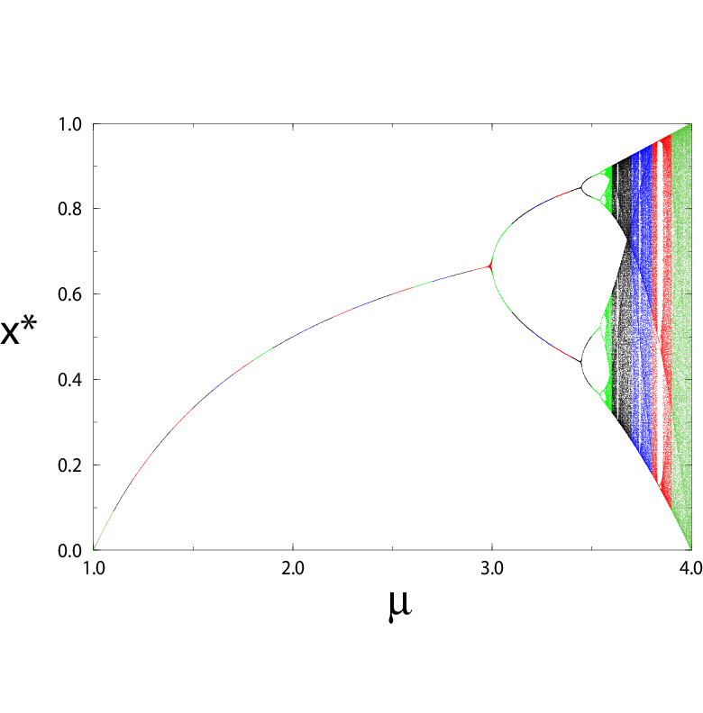
 
 *  Can't vary intensity
 * Vary point density
 * Resolution $\sim$  300 DPI
 *  $3000 \times 3000 \simeq 10^7$ pts
 * Big, more = waste
 * Create 1000 bins   
 * $1 \leq \mu \leq 4$
 * Print $x_{*}$  3-4 decimal places
 * Remove duplicates
 * Enlarge:  {self-similarity}
 *  Observe  windows
 
 

Problem: Realistic Single or Double Pendulum

Simulate Nonlinear, Chaotic System
 
   * Driven single pendulum 
   * Free, double pendulum
   * Large oscillations, even over-the-top
   
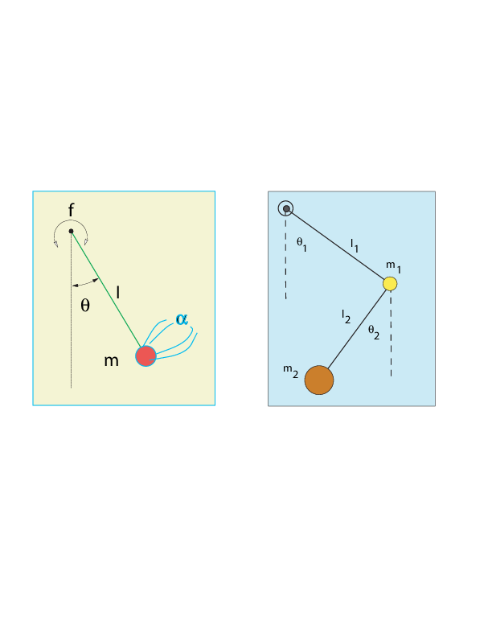

### ODE

#### Chaotic Pendulum ODE
##### Newton's Laws for Rotational Motion   $\sum \tau \,=\, I \ \frac{d^2\theta}{dt^2}$ 

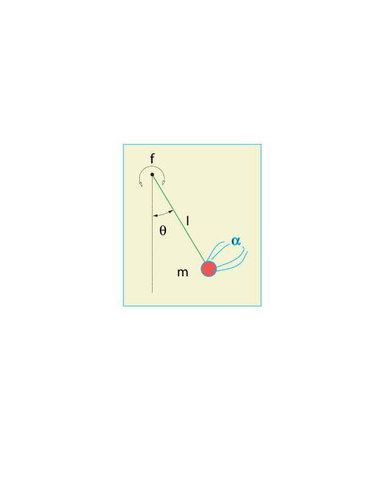

 *  Gravitation $\tau$: $-mgl\sin\theta$
 * Friction $\tau$:   $-\beta\dot{\theta}$
 * External $\tau$:  $\tau_0\cos \,\omega t$

 
\begin{align}
I\, \frac{d^{2}\theta} {dt^{2}} = &   - {mgl}\, \sin\theta
 - \beta \, \frac{d\theta}{dt}
  + \tau_{0} \cos\omega t 
 { \frac{d^{2}\theta} {dt^{2}}   =}  &
  {-\omega_{0}^{2}  \,\sin \theta  -\alpha \,\frac{d\theta}{dt} +
f\cos\omega t} 
\end{align}

$$
\omega_{0}    =  \frac{mgl}{I},\quad \alpha =
\frac{\beta}{I}, \quad f =\frac{\tau_0}{I}
$$

 
#### Chaotic Pendulum ODE
##### Standard ODE Form (rk4): $\quad \dot{\vec{y}} = \vec{f}(\vec{y}, t)$}

  $$ \frac{d^{2}\theta}{dt^{2}}   =
-\omega_{0}^{2}  \,\sin \theta  -\alpha \,\frac{d\theta}{dt} +
f\cos\omega t
$$

 * 2$^{nd}$ O t-dependent nonlinear ODE
* Nonlinearity:  $\sin\theta \simeq \theta -\theta^3/3! \cdots$
 * $ y^{(0)} =  \theta(t), \quad y^{(1)} = \frac{d\theta(t)}{dt}$

  \begin{align}
{\frac{dy^{(0)}}{dt} \ =\ }&  {y^{(1)}}
{\frac{dy^{(1)}}{dt}  \ =\  }& {- \omega_{0}^{2} \sin y^{(0)} - \alpha
y^{(1)} + f\cos\omega t}
\end{align}

### Free Pend

#### Start Simply: Free Oscillations (Test Algorithm \& Physics)
Ignore Friction \& External Torques ($f= \alpha = 0$)

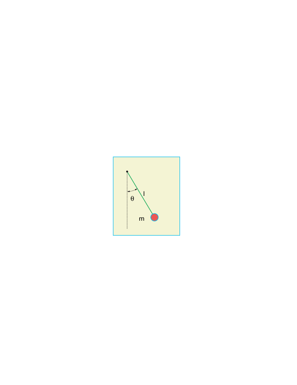

\begin{align}
 {\ddot{\theta}  =} & {-\omega_{0}^{2} \sin \theta }  \label{6}
  \ddot{\theta} \  \simeq\  & -\omega_0^2 \theta \quad\quad \mbox{(linear,  $\theta\simeq 0$)}\nonumber
 \Rightarrow \enskip\theta(t) \ =\  & \theta_{0} \sin(\omega_{0} t
+ \phi)
\end{align}

''Analytic solution''; sort of:

$$
 T  \propto
\int_{0}^{\theta_m}\frac{d\theta}{ \left[\sin^{2}({\theta_m}/{2})
- \sin^{2}({\theta}/{2})\right]^{1/2}}
$$

#### Visualization: Phase Space Orbits
##### Abstract Space: $v(t)$ vs $x(t)\ $ ($x$ vs $t$, $v$ vs $t$= Complicated)}

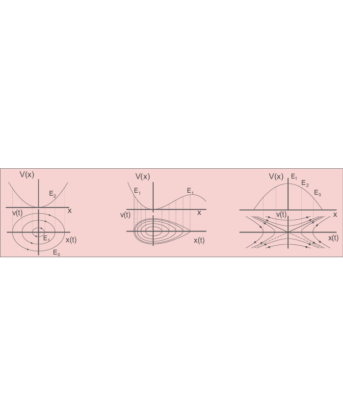

* Geometry easy to "see"
* SHM: Ellipse, $E\rightarrow$ size
* Anharmonic:  + corners
 
 * Ossc $\implies$ CW Closed
 * Non Ossc, repulse = open

\begin{align}
x(t)=&  A \sin(\omega t),\quad v(t)   = \omega A
\cos(\omega t)\quad (SHM)
E  = & {\rm KE} + {\rm PE} =   m {v^{2}}/2 +
 \omega^{2}m^{2}{x^{2}}/2=  \mbox{ellipse}
\end{align}

 #### Undriven, Frictionless Pendulum in Phase Space

Separatrix  Separates Open \& Closed Orbits
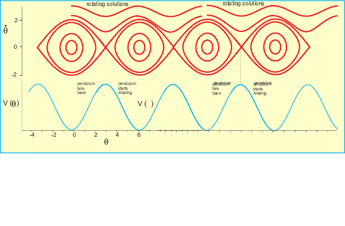

  * Closed: oscillation
  * Open: rotation
  * Both: periodic
 *  Orbits do not cross

 *  Open orbits touch
 * Hyperbolic points
 * Unstable equilibrium

 #### Include Friction, Driving Torque (small t steps)

##### Geometry Tends to Remain

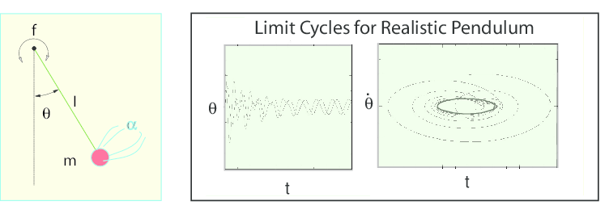

 *  Friction $\implies$ $\downarrow$ E
 *  Inward Spiral
 * $\tau_{\rm ext}$ can put $E$ back

 * Limit cycle = Balance 
 * $<\tau_{\rm ext}> \ = \ <\mbox{friction}> $

#### Chaos As Viewed in Phase Space (Full Solution)

##### Look for in Your Simulations

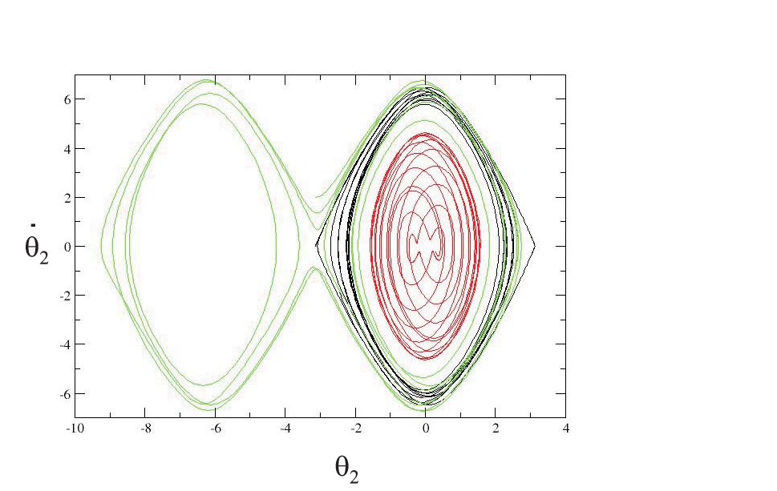
 
  * Complex $\leq$ Chaos $\leq$ Rand
  * Fixed Params, all $x_0$, $t$s:  flows 
 
 * Chaos complex $\neq$ mess
 * Figs distort, remains
 * Closed = periodic 
 * Simplicity in chaos [PS, $\neq \theta(t)$]
  * $\rightarrow$ attractors (return)
  * Random = cloud fill $E$
  * {Bands} $\implies$ continuity, sequential
  * $\implies$ hypersensitive $\theta(t)$
  * Tools measure chaos
 

### Double Pendulum
#### Double Pendulum: Alternative Problem

##### Chaos without External Torque or Friction

* No small-$\theta$
* Coupling = extra degree freedom
* Small $\theta$: in-$\phi$, out-$\phi$

\begin{align}
L =& {\rm KE}-{\rm PE} =  (m_1+m_2) l_1^2
\dot{\theta_1}^2/2 +  m_2l_2^2\dot{\theta_2}^2/2\\
& +\, m_2l_1l_2
\dot{\theta_1}\dot{\theta_2}\cos(\theta_1-\theta_2) +(m_1+m_2)g
l_1\cos\theta_1 + m_2g l_2\cos\theta_2 \nonumber
\Rightarrow\quad & (m_1+m_2)l_1\ddot{\theta_1} +
m_2l_2\ddot{\theta_2}\cos(\theta_1-\theta_2) + m_2 l_2 \dot{\theta_2}^2
\sin(\theta_1-\theta_2)
&\quad + g(m_1+m_2)\sin\theta_1 = 0  \nonumber\\
&m_2l_2\ddot{\theta_2}+m_2l_1\ddot{\theta_1}\cos(\theta_1-\theta_2)-
m_2l_1\dot{\theta_1}^2\sin(\theta_1-\theta_2)  +  mg\sin\theta_2 =
0
\end{align}

#### Double Pendulum: Bifurcations

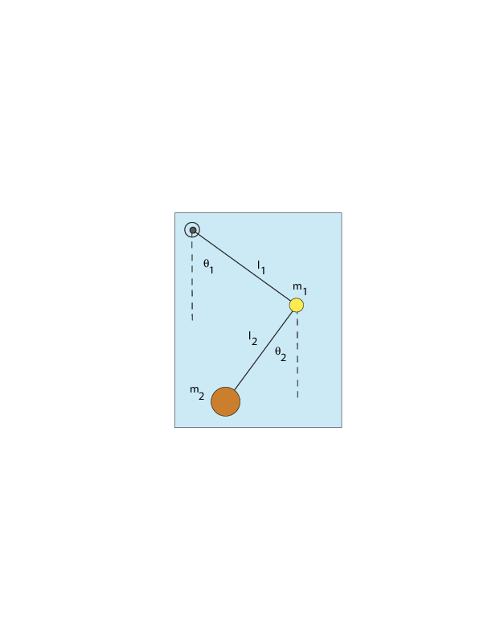
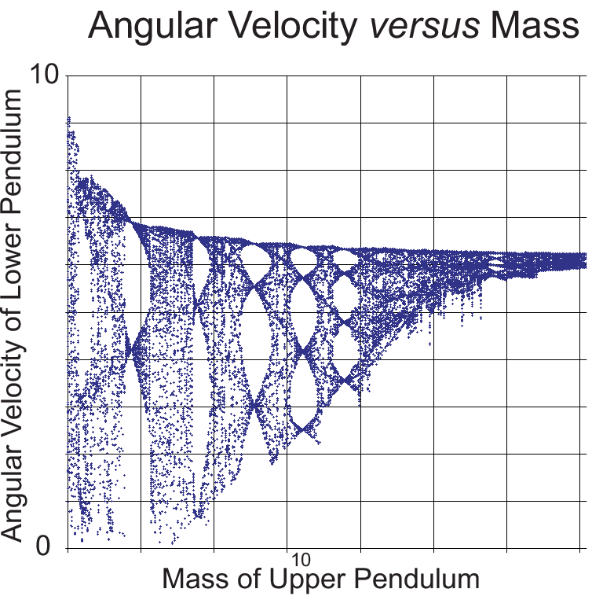

